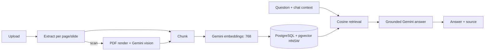

# CourseLens

> **Your course material. One place. Every answer traceable.**

## Overview

CourseLens is a study assistant that answers only from uploaded course material. It uses Angular, Spring Boot, PostgreSQL/pgvector, and Gemini, and attaches real evidence metadata to each supported answer.

## Problem

Notes live across PDFs, slides, scans, and text files. General chat answers cannot be trusted as course-specific evidence. CourseLens makes the supplied material the boundary of what it answers.

## Key Features

- PDF, PPTX, TXT, Markdown, PNG, JPG, and JPEG uploads.
- Gemini Embedding 2 at 768 dimensions with pgvector-native cosine retrieval.
- Explicit `ANSWERED` or `NOT_COVERED` result.
- Scanned/handwritten page transcription, persistent multi-turn chat, and page-specific evidence.

## How It Works



## Architecture

CourseLens is a modular monolith: Spring MVC exposes a small API, in-process services handle ingestion/extraction/retrieval/generation, and PostgreSQL stores documents, pages, chunks, sessions, and messages. This is deliberately easy to run for a polished demo.

## Tech Stack

- Angular 19 and TypeScript
- Java 17, Spring Boot, JPA, Flyway
- PostgreSQL, pgvector `vector(768)`, HNSW cosine index
- Gemini generation, Gemini vision, Gemini Embedding 2
- PDFBox and Apache POI

## RAG Pipeline

Material is extracted per page or slide, chunked with overlap, embedded, and stored in pgvector. A question and recent persisted conversation context are embedded, then queried with pgvector’s cosine-distance operator. The application supplies the retrieved evidence to Gemini and creates source references itself.

## Handwritten/Scanned Material Pipeline

When PDFBox finds no meaningful text on a PDF page, CourseLens renders that page to PNG and sends it to Gemini multimodal vision for transcription. The transcription is then chunked and embedded. CourseLens does **not** train a custom OCR model; handwritten evidence is identified in the API and interface.

## Grounding and Refusal Behavior

- Supporting material present → `ANSWERED` with sources.
- Evidence absent or insufficient → `NOT_COVERED`.

The generation prompt makes evidence the only source of truth, prohibits general-knowledge completion and invented citations, and asks Gemini to return exactly `NOT_COVERED` when it cannot fully support an answer.

## Multi-document and Multi-turn Conversations

Retrieval is global across uploaded documents, allowing an answer to use multiple course sources. `chat_sessions` and `chat_messages` persist the conversation; the latest messages are included in follow-up retrieval even after restart.

## Evaluation

[`evaluation/cases.json`](evaluation/cases.json) has 20 answerable cases (10 single-document, 10 multi-document) and 10 required refusals, including handwritten cases. The public [corpus manifest](evaluation/corpus/README.md) specifies a 60-page/slide five-format corpus without committing private notes.

```bash
node evaluation/run-evaluation.mjs evaluation/cases.json http://localhost:8080
```

The runner reports measured status, refusal, citation, and source checks only; no unrun scores are claimed.

## Project Structure

```text
src/main/java/.../api       REST endpoints and DTOs
src/main/java/.../service   ingestion, extraction, retrieval, generation
src/main/java/.../domain    JPA entities and pgvector mapping
src/main/resources/db       Flyway PostgreSQL migrations
frontend/                   Angular app
evaluation/                 evaluation cases, runner, corpus manifest
```

## Prerequisites

- JDK 17+, Node.js 20+, PostgreSQL 15+ with pgvector
- Gemini API key for ingestion and answer generation

## Local Setup

```bash
git clone https://github.com/pj1234567890/courselens.git
cd courselens
copy .env.example .env
```

Set the values in your shell or IDE; `.env` is ignored and is not loaded automatically by Spring.

## Environment Variables

| Variable | Purpose |
| --- | --- |
| `GEMINI_API_KEY` | Embeddings, vision transcription, generation |
| `DATABASE_URL` | PostgreSQL JDBC URL |
| `DATABASE_USERNAME`, `DATABASE_PASSWORD` | Database credentials |
| `COURSELENS_STORAGE_DIR` | Upload directory; default `./data/uploads` |
| `COURSELENS_MAX_COSINE_DISTANCE` | Evidence cutoff; default `0.65` |

`.env.example` holds placeholders only. Never commit real credentials.

## PostgreSQL + pgvector Setup

Create a `courselens` database, install its `vector` extension, and enable the PostgreSQL profile. Flyway creates the schema and HNSW index.

```bash
set SPRING_PROFILES_ACTIVE=postgres
set DATABASE_URL=jdbc:postgresql://localhost:5432/courselens
set DATABASE_USERNAME=postgres
set DATABASE_PASSWORD=replace_me
```

## Running Backend

```bash
./mvnw.cmd spring-boot:run
```

## Running Frontend

```bash
cd frontend
npm install
npm start
```

Open `http://localhost:4200`; its development proxy forwards `/api` to port 8080.

## Example Questions

- “What is a collective noun?”
- “What are the four types of noun gender mentioned in my notes?”
- “What does that mean?”
- “Give me an example.”

Questions outside uploaded material return `NOT_COVERED`.

## Screenshots / Demo

Add screenshots or a short recording here before publishing. The laptop-ready interface presents materials, conversation, and evidence side by side.

## Limitations

- A live pipeline needs PostgreSQL and Gemini credentials.
- Source quality affects retrieval quality.
- PDF citations open an isolated visual page; PPTX citations currently return the cited slide’s extracted text.
- Ingestion is synchronous for this demo.

## Future Improvements

- Background ingestion progress.
- Rendered PPTX slide previews.
- Collection controls and real-run evaluation dashboards.

## License

No license has been selected yet. Add one before redistribution.
